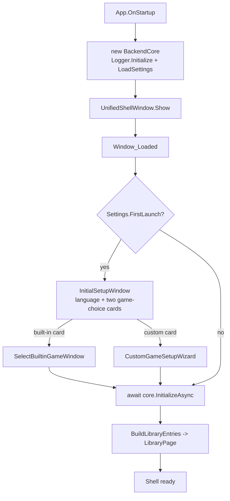
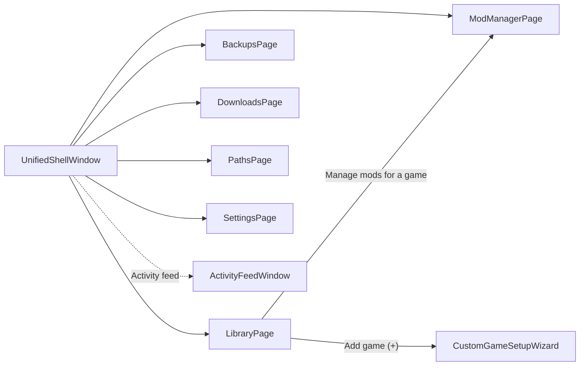
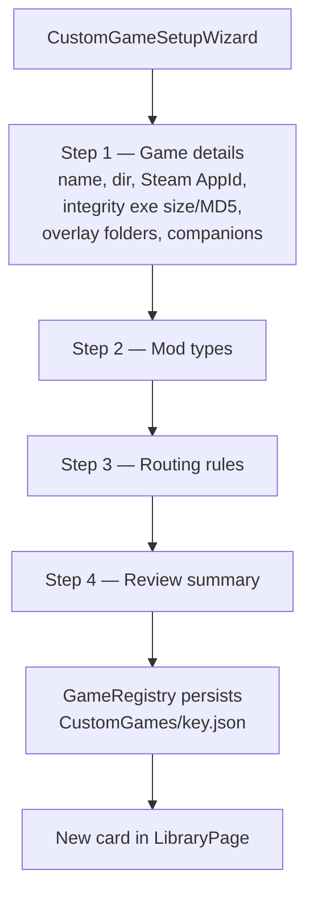
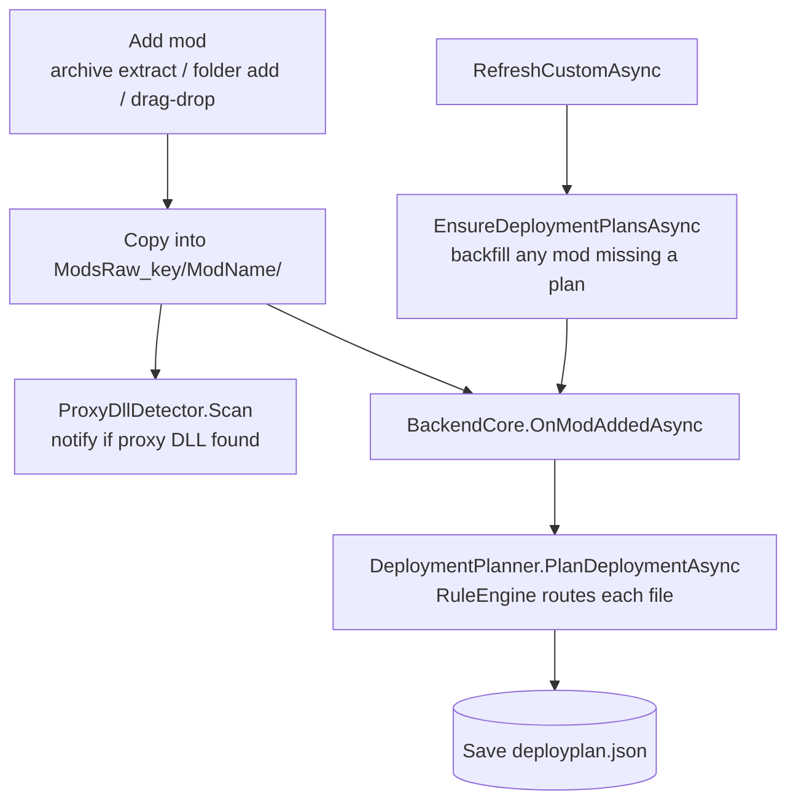
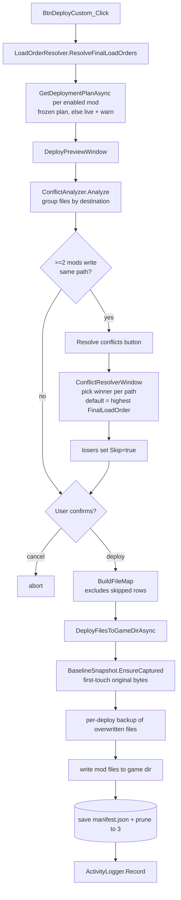
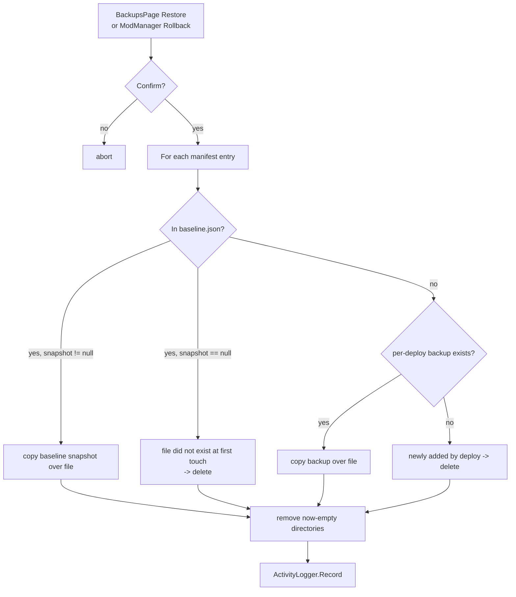
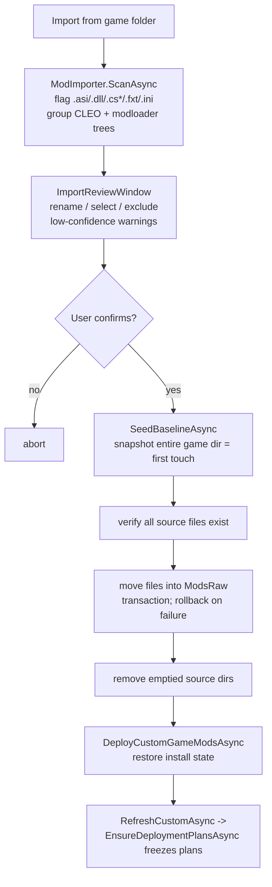
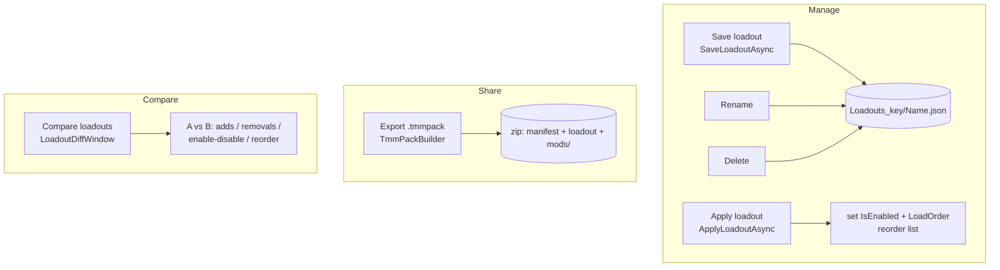

# TMM — UI Flow Charts

> Mermaid diagrams of how the program's UI operates. Renders on GitHub.
> Each flow cites the code path that drives it. Keep in sync when navigation changes.
>
> Generated during the 2026-05-29 audit. Source of truth is the code — if a diagram
> and the code disagree, the code wins; fix the diagram.

---

## 1. App startup & first-launch

`App.OnStartup` constructs `BackendCore` (which calls `Logger.Initialize` + `LoadSettings`)
then shows the single main window. First-launch onboarding is gated on
`Settings.FirstLaunch` inside `UnifiedShellWindow.Window_Loaded`.

**Updated v0.1-alpha-9 (S7 done):** `FirstGamePickerWindow` was removed; its built-in/custom
choice cards now live directly in `InitialSetupWindow` below the language picker — one screen
instead of two.

---

## 2. Shell navigation

`UnifiedShellWindow` is a single window hosting swappable pages (no separate windows
for the main areas). The left nav switches `_currentPage`.

---

## 3. Add a custom game (wizard)

Per the standing rule, every built-in capability must be reachable here. The `.tmmgame`
JSON is only a shortcut for bundled profiles.

---

## 4. Install a mod → freeze the deployment plan

Per architectural principle #1, rules run **once** at install and the resulting
`DeploymentPlan` is frozen to `_tmm/deployplan.json`. Deploys execute the saved plan.

---

## 5. Deploy (with preview + conflict resolution)

`BtnDeployCustom_Click` resolves load order, builds frozen plans, shows the preview,
then deploys only the rows the user kept. Cross-mod conflicts are arbitrated in the
resolver; baseline capture happens just before each overwrite.

---

## 6. Rollback / restore

Rollback's source of truth is the first-touch `baseline.json`; the per-deploy manifest
is only the index of *which* files to revert. Falls back to per-deploy backup if a
baseline record is missing.

---

## 7. Import from an existing modded install (B5)

Point TMM at a pre-modded directory; heuristically detect mods; move (not copy) them
into `ModsRaw_key` as managed mods, then re-deploy to restore the install untouched.

---

## 8. Loadouts

A loadout snapshots enabled-state + load order. `.tmmpack` bundles a loadout plus the
mod source folders for sharing.

> ⚠️ **Gap noted in audit:** `.tmmpack` can be **exported** but there is no import/consume
> path yet — a shared pack can't currently be loaded back into TMM.
